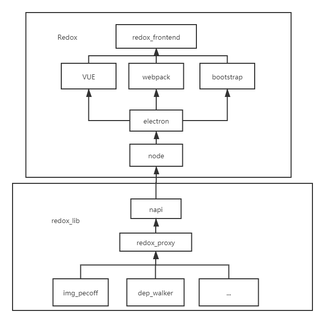

# redox-lib
libs of project REDOX.

## 简介
redox项目的静态库，生成redox_proxy.node。redox中通过require调用其中的功能。
* img_pecoff
  * x86/amd64PE格式解析
* dep_walker
  * 分析文件依赖
* redox_utils
  * 文件属性
* redox_proxy
  * 将napi进行高级封装。
  * 将所有信息封装到js对象中并暴露给前端。

## 架构图
